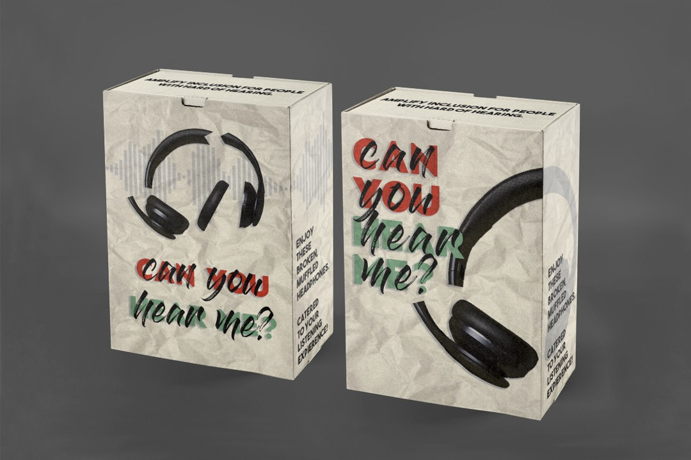
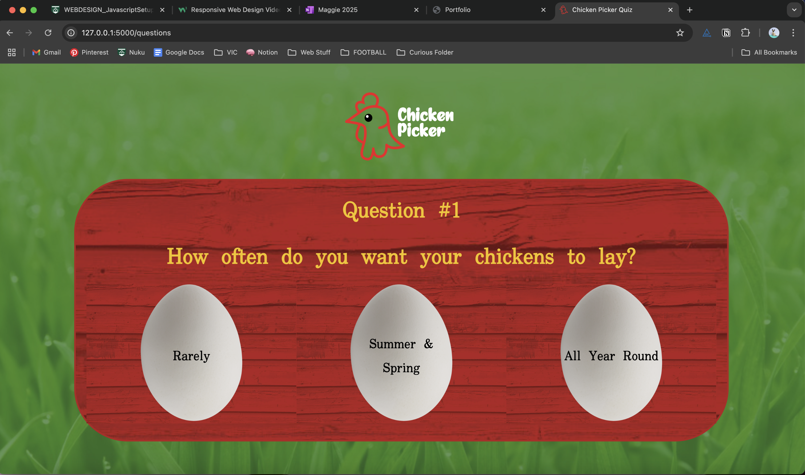

Hello! Here is all the that is all the trial and error I did throughout the website design process. Most of this is removed in the final coding version as they were all errors, however I wanted to notate anyway. 

CONTAINER TESTING - HTML

<!--
		

			

				<h1>Blog:</h1>
					
Hello, my mame is Maggie McMillan-Perry! I am a Third Year Student Majoring in Social Innovation and Interaction Design and minoring in Health Policy. My overarching aim is to make more designs that champion accessibility within the healthcare sector.    
					My goal for this course is to expand my website development skills and to update my portfolio which needs a makeover! 
					  My guiding questions for this course are: How can websites be more visually dynamic to retain attention to users and how can we make websites more accessible to people with disabilities?

		

		
			
			
Content1

			
Content2

			
Content3

			
Content4

			
Content5

			
Content6

		
   
-->

CSS: 

.container {
	display: grid;
	grid-template-rows: repeat(3, 1fr);
	grid-template-columns: repeat(12, 1fr);
	grid-column-gap: 2em;
	grid-row-gap: 3em;
	grid-template-areas: 
	" 	.		header  header 	header 	header header header header header header header ."
	" 	.		header  header 	header 	header header header header header header header .";
}

.container_2 {
	display: grid;
	grid-template-rows: repeat(4, 1fr);
	gap: 1em;
	grid-auto-rows: repeat(4, 1fr);
	grid-template-areas: 
	" 	.		content1  content1 	. 	content2 content2 . content3 content3 . "
	" 	.		content1  content1 	. 	content2 content2 . content3 content3 . "
	" 	.		content4  content4 	. 	content5 content5 . content6 content6 . "
	" 	.		content4  content4 	. 	content5 content5 . content6 content6 . "
}

.header {
	grid-area: header;
	justify-self: center;
	align-items: center;
	margin-top: 50px;
}

.content1 { 
	grid-area: content1;
}

.content2 { 
	grid-area: content2;
 }

 .content3 { 
	grid-area: content3;
 }

.content4 { 
	grid-area: content4;
 }

 .content5 { 
	grid-area: content5;
 }

 .content6 { 
	grid-area: content6;
 }

 .item {
 	background-color: limegreen;
 	color: black;
 	text-align: center;
 	padding: 1em;
 	font-size: 2em;
 }

 .headers { 
 	margin-top: 75px;
	text-align: center;
 }

 .headers h1 {
	font-weight: 600; 
	font-size: 40px;
	text-align: center;
	color: white; 
}

.headers h2 {
	font-style: italic;
}

<!-- OLD COLLUMNS -->

.column {
  float: left;
  width: 30%;
  padding: 20px;
}

.row:after {
  content: "";
  display: table;
  clear: both;
}

.column img {
	max-width: 100%;
	height: auto;
}

.column_left {
	float: left;
  width: 30%;
  padding: 20px;
}

.column_rest {
	float: left;
  width: 60%;
  padding: 20px;
  aspect-ratio: 1/1;
  object-fit: cover;
  background: red;
}

<!--EXTRA PROJECTS that did not make the index/portfolio page -->

 <!-- 

			

				

					
					
Phytoplankton Terrarium

				

			

			

				

					
					
'Can you Hear Me?' Product Box

				

			

			

				

					
					
Personal Projects

				

			

		
 -->

